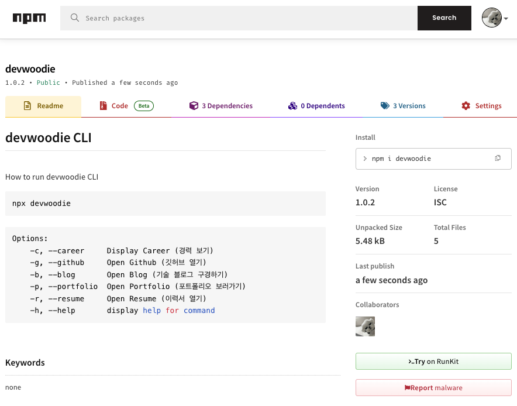

오늘 개발 블로그를 둘러보다가 프론트엔드 개발자이신 단민님의 최근 포스트를 마주하게 되었다.<br/>
node.js로 cli 포트폴리오를 만들어서 npm에 배포하는 글이었다.

상당히 흥미로운 글이었다.

전부터 npm 라이브러리를 만들고 배포해서 유용하게 쓸 수 있는 개발자가 되고 싶은 생각이 있었는데<br/>
이번에 배포한 작디작은 CLI가 그 생각의 `씨앗`이 되길 바라며...
<br/>
<br/>

### 시작해보자.
> 단민님의 글 뿐만아니라 여기저기 블로그를 참고했다.

먼저 디렉토리 구조는 아래와 같다.
```bash
├── package-lock.json
├── package.json
└── src
    ├── cli.js
    ├── init.js
    └── utils.js
```

### package.json
새로 프로젝트를 생성한 후 `npm init -y` 명령어로 package.json 을 생성한다.<br/>
<small>(node가 설치되어 있다는 전제하에)</small><br/>
<br/>
사용하는 라이브러리는<br/>
- chalk (터미널 글씨 스타일 적용)
- commander (Node.js에서 CLI프로그램을 작성할 때 유용한 라이브러리)
- inquirer (터미널에서 사용자와 상호작용할 수 있는 질문(prompt) 시스템을 제공)
<br/>

`package.json`
```json
{
    "name": "devwoodie",
    "author": "devwoodie",
    "version": "1.0.2",
    "description": "CLI for devwoodie",
    "main": "src/cli.js",
    "files": [
        "src"
    ],
    "bin": {
        "devwoodie": "./src/cli.js"
    },
    "keywords": [],
    "license": "ISC",
    "dependencies": {
        "chalk": "^4.1.2",
        "commander": "12.1.0",
        "inquirer": "^8.1.2"
    }
}
```

### init.js
src 폴더 생성 후에 `init.js` 파일을 생성한다.<br/>
실행했을 때 처음 나오는 내용으로 `아니오`를 선택하게 되면 `네`를 선택할 때까지 반복 질문한다.<br/>

```js
#!/usr/bin/env node
const inquirer = require('inquirer');
const chalk = require('chalk');
const { logCareers, open } = require('./utils');

const init = async () => {
  const questions = [
    {
      type: "list",
      name: "action",
      message: "어서오세요! 저에 대해 궁금하신가요?",
      choices: [chalk.blue("네"), chalk.red("아니오")],
    },
  ]

  return inquirer.prompt(questions).then((result) => {
    if(result.action === chalk.red("아니오")) {
      console.log(chalk.red("\n다시 묻겠습니다.\n"));
      init();
    }else{
      console.log(chalk.cyan("\n안녕하세요."));
      console.log(chalk.cyan("\n프론트엔드 개발자 유동우 입니다.\n"));
    };
  });
}

module.exports = init;
```

### cli.js
src 폴더 안에 `cli.js` 파일을 생성한다.<br/>
`npx devwoodie --help` 명령어를 입력했을 때 나오는 내용이다.
```js
#!/usr/bin/env node
const { Command } = require('commander');
const program = new Command();
const chalk = require('chalk');
const init = require('./init');
const { logCareers, open } = require('./utils');

program
    .version('1.0.2', '-v', 'version')
    .description(`${chalk.red("CLI")} for ${chalk.cyan("DEVWOODIE")}`)
    .option("-c, --career", chalk.cyan("Display Career (경력 보기)"))
    .option("-g, --github", chalk.yellow("Open Github (깃허브 열기)"))
    .option("-b, --blog", chalk.green("Open Blog (기술 블로그 구경하기)"))
    .option("-p, --portfolio", chalk.magenta("Open Portfolio (포트폴리오 보러가기)"))
    .option("-r, --resume", chalk.cyan("Open Resume (이력서 열기)"))
    .parse(process.argv)

const options = program.opts();

if (options.career) {
    logCareers();
}
if (options.github) {
    open("github");
}
if (options.blog) {
    open("blog");
}
if (options.portfolio) {
    open("portfolio");
}
if (options.resume) {
    open("resume");
}

init();
```

### utils.js
src 폴더 안에 `utils.js` 파일을 생성한다.<br/>
`cli.js`에서 사용되는 함수로 크롬 새 창으로 url을 열거나 터미널에 표를 만들어주는 내용이다.
```js
const { exec } = require('child_process');
const chalk = require('chalk');

const careers = [
    //내용
];

const logCareers = () => {
    console.log(chalk.cyan("\n[ Careers ]"));
    console.table(careers);
    process.exit();
};

const open = (type) => {
    exec(`open -a Google\\ Chrome ${url[type]}`);
    process.exit();
};

module.exports = { logCareers, open };
```

### npm 배포
마지막으로 npm에 로그인 후 배포해주면 완료.<br/>
readme에 정리된 내용이 npm 사이트에 나오게 된다. 배포할 때마다 버전을 변경해줘야한다.
[https://www.npmjs.com/package/devwoodie](https://www.npmjs.com/package/devwoodie)

```bash
npm login
npm publish
```



<br/>

<small>[참고] [https://www.jeong-min.com/70-cli](https://www.jeong-min.com/70-cli)</small>

```toc
```