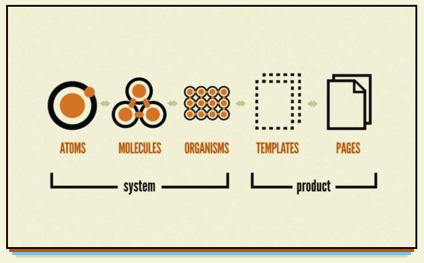

Next 또는 React로 프론트엔드 개발을 하다 보면 항상 드는 생각이 있다.
> "내가 컴포넌트를 잘 분리한 건가.."

디자인 시스템을 공부하고 적극 활용해 본 경험은 없고 그냥 뭉뚱그려 생각하고 진행했던 것 같다.

디자인 시스템을 생각하고 개발을 진행하면 처음엔 불편할지라도 시간이 지나고 나면 만족할 만한 결과가 나오지 않을까 하는 생각이 들었다.

그 중 가장 흥미가 가는 `Atomic`
<br />
<br />

## Atomic Design

아토믹 디자인은 `화학적 관점`에서 영감을 얻은 디자인 시스템 방법론이다.<br />
**화학적 관점** 이란 말이 흥미를 돋우었다.<br />

먼저 Atom은 분해할 수 없는 단위인 **원자**를 의미한다.

`원자`가 모여서 `분자`를 만들고 `분자`가 모여서 `유기체`를 만들고..

Atomic 디자인 역시 **각 요소를 분해할 수 없는 단위까지 나누고, 이를 조합하여 컴포넌트를 만들고 나아가 페이지를 구성하는 방식**을 의미한다.


<br />

### Atom(원자)
Atom은 더 이상 분해할 수 없는 기본 컴포넌트로 **input, label, button 과 같이 기본 Html태그 또는 폰트, 애니메이션과 같은 추상적인 요소**도 포함될 수 있다.

- 마진, 위치 값이 없고 단일 컴포넌트로 사용하기엔 힘들다.
- 어떤 context가 주어지던지 이에 해당하는 컴포넌트가 생성될 수 있어야 한다.
<br />

### Molecule(분자)
Molecule은 **Atom들이 결합한 상태**이다. 예를들어 input과 button이 합쳐져 form을 전송하는 Molecule이 되는 것이다.

- 한 가지 일을 해야한다.
- 분자가 원자의 위치 값을 지정하기도 한다.
<br />

### Organism(유기체)
Atom, Molecule 보다 조금 더 구체적으로 표현되고 **서비스에서 표현될 수 있는 명확한 영역과 특정 맥락**을 가졌다. <br />

- 분자가 되지 않은 Atom이 엮이기도 한다.
- Organism는 분자와 원자의 위치 값을 조정한다.
- Atom, Molecule에 비해 상대적으로 재사용성이 낮아지는 특성이 있다.
<br />

### Template(템플릿)
Template은 page를 만들 수 있도록 **여러개의 Organism, Molecule로 구성**되어 있다.<br />

- 실제 컴포넌트를 레이아웃에 배치하고 수조를 잡는 와이어 프레임이다.
- 스타일이나 컬러가 들어가지 않는다.
- 실제 컨텐츠가 없는 page 수준의 스켈레톤이라 할 수 있다.
<br />

### Page(페이지)
Page는 **유저가 볼 수 있는 실제 컨텐츠**를 담고 있다.

- Template를 이용해 각 그리드에 컴포넌트를 그린다.
<br />


> 생각보다 생각이 많이 필요하잖아..?

어디까지가 Molecule이고 어디까지 Organism에 포함되는건지.. 직접 해보면서 알아가야할 것 같다.

## Next.js 에 쓰면 딱이잖아
Atomic 디자인 방식은 하부 컴포넌트들을 Page라는 상위 컴포넌트에서 불러온다.

Next.js는 pages 폴더와 파일 명으로 라우팅하기 때문에 기존 리액트에 비해 파일과 폴더 분리가 잘 되어있다. 그리고 pages 폴더와 components 폴더가 분리되어 있어도 결과적으로 pages 폴더를 통해 로직을 구성하고, components 폴더 내의 Atomic 디자인들은 추상화 혹은 정의된 props의 로직만 처리하면 되기 때문에 개발자 입장에서는 pages 폴더의 page로 관심사가 컴파운드 되어있다는 느낌을 받을 수 있다고 한다.
<br />
<br />
<br />

'Next.js가 잘 맞는 이유' <br />
[출처] [https://velog.io/@bluecoolgod80](https://velog.io/@bluecoolgod80/%EC%95%84%ED%86%A0%EB%AF%B9-%EB%94%94%EC%9E%90%EC%9D%B8-%EB%B0%A9%EC%8B%9D%EC%9C%BC%EB%A1%9C-%ED%8F%B4%EB%8D%94%EB%A5%BC-%EA%B5%AC%EC%84%B1%ED%95%98%EA%B8%B0)

```toc
```