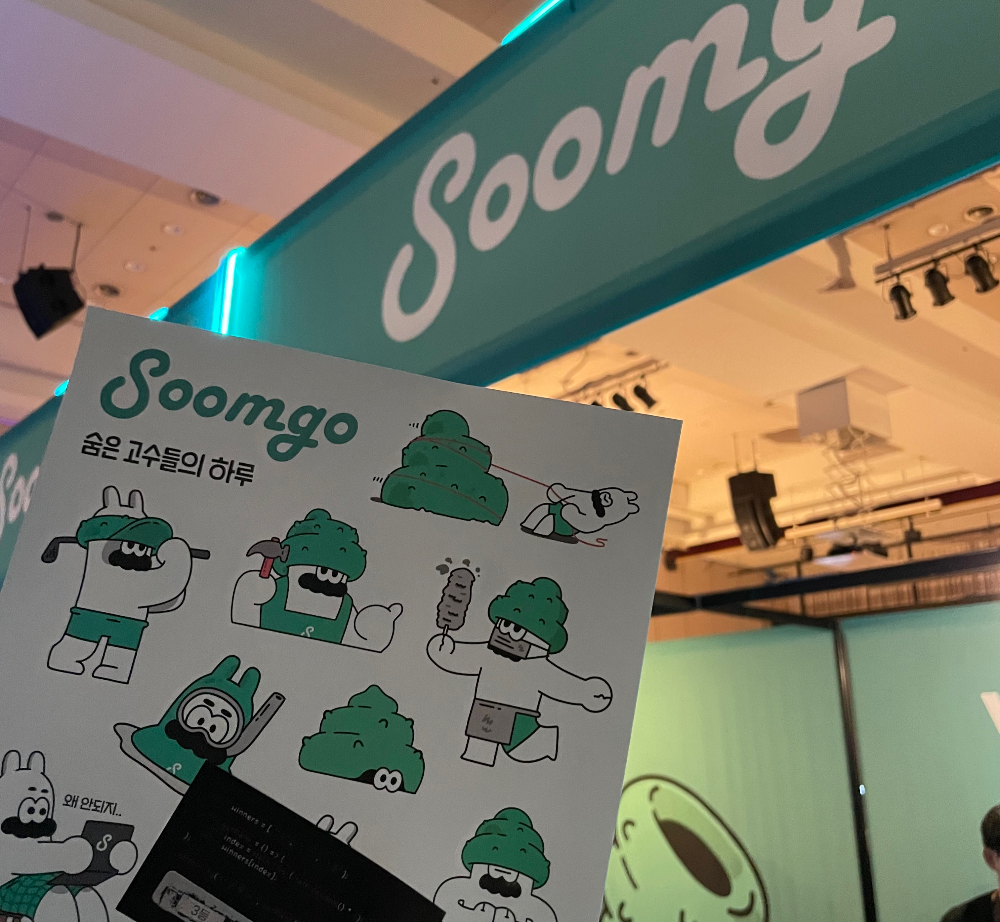

정말 오랜만에 컨퍼런스를 다녀왔다.

2022년에는 운이 좋게도 INFCON 과 NHN 컨퍼런스에 당첨이 되어서 다녀왔는데 2023년에는 아무 행사도 참여하지 못했다. <br/>
2024년 올해 INFCON에 당첨되지 못했지만 Frontend 컨퍼런스인 FECONF에 운이 좋게 신청을 하게 되어서 참석하였다. <br/>
신청 당일인 오전 11시에 업무가 바빠서 신청하지 못했는데, 이미 매진이 되고 난 후에 오후까지 새로고침을 하면서 취소 표를 기다렸다. <br/>
운이 좋게도 취소표가 올라와 구매를 했던 기억이 있다.

## FECONF 2024

컨퍼런스가 열린 곳은 세종대학교

멀다.. 자차로 다녀오긴 했지만, 컨퍼런스를 선착순으로 예매할 때도 50,000원이라는 지출이 있는데 주차 요금은 별개로 받는다. <br/>
뭐 당연한거겠지만 세종대 광개토관에서 열린 컨퍼런스에 일찍 가지 못하면 걸어서 5 ~ 10분 정도에 있는 주차장에 주차를 해야한다.


이번 FECONF 2024는 발표 세션 A/B, 후원사 홀(굿즈를 받을 수 있는 곳) C 이렇게 3군데가 준비되어 있었다. 

후원사 C 홀 안쪽에는 Lightning Talk 테이블이 네 개 마련되어 있었다.


첫 번째 강연을 포기하고 바로 후원사 홀로 향했다. 이번에 참석한 후원사로는 아래와 같다.

- Google Cloud
- Soomgo
- WOORI TECH
- WYYYES
- imweb
- Olive Young
- 당근
- toss
- 요즘 IT


들어가서 바로 정면에 WOORI TECH 와 Soomgo 부스가 있었고 Soomgo에서 여는 뽑기 이벤트에 참여했는데.. 그냥 3등ㅎ



그리고 양 옆으로 후원사들이 있고 부스 3개를 쓰고 있는 Google Cloud 가 있다.


Google Cloud에서는 냉장고 안에 있는 재료들을 사진 찍어 인식하면 사진을 분석하여 레시피를 추천해주는 서비스였다.
이벤트에 참여하면 뽑기를 할 수 있는데 거기서 스포츠 백을 받았다.


## Speaker

굿즈를 어느 정도 확보 후에 강연을 들었다. 

프론트엔드 개발자만 모이는 컨퍼런스여서 그랬는지 강연은 많지 않았다.

그래도 나는 듣고 싶었던 강연을 들었지만, 강당이 넓어서 많은 인원이 들어올 수 있었는데 생각보다 일찍 집에 가는 사람들도 많았고 후원사 홀에 사람이 더 많았던 것 같다.

## 컨퍼런스의 꽃 🌼

나는 **컨퍼런스의 꽃**은 굿즈라고 생각한다.

어떤 후원사가 있는지부터 시작해서 그 후원사에서 어떤 굿즈를 나눠주는지가 제일 궁금했던 것 같다.

마지막에 **imweb**에서는 설문에 참여한 사람들에 한해 추첨을 통해 에어팟 맥스 1, 레오폴드 키보드 3개를 나눠줬다. <br/>
기대했지만 역시나..<br/>

그래도 뭐 나름 만족해ㅎ


<br/>

이번 컨퍼런스를 다녀와서 아쉬웠던 점
- 오랜만에 컨퍼런스여서 그랬는지 기대가 컸던 점 (내 문제긴 하지ㅎ)
- 지하 2층에서 진행했는데 장소가 넓지 않고 사람들이 모여있어서 데이터가 잘 안터짐
  - 후원사 부스들은 보통 QR코드 인식해서 설문 or 구독하는게 대부분인데 너무 느렸음
  - 강연할 때 나는 노션으로 기록했는데 온라인이다 보니 저장이 바로바로 안됐음
- 신청비 5만원인 것 치고 주는게 뭐 없달까..
  - 내부에서 걸고 다니는 목걸이에 이름도 없고 그냥 종이였음
- 내부가 너무 어두웠음
  - 강연하는 곳은 그럴 수 있는데 후원사 홀이 너무 어두운 느낌

뭐 등등.. 지극히 개인적인 내 생각이었음

그래도 같은 직군인 프론트엔드 개발자들끼리 모여서 컨퍼런스를 하니까 재밌었던 것 같다.

<br/>
<br/>
<br/>

이번 9월에 토스 컨퍼런스인 **SLASH 24** 도 신청했는데 매년 영상으로만 봤었지만 올해는 참석해보고 싶다.

https://toss.im/slash-24 <br/>
`당첨되기 위한 노력`


```toc
```
