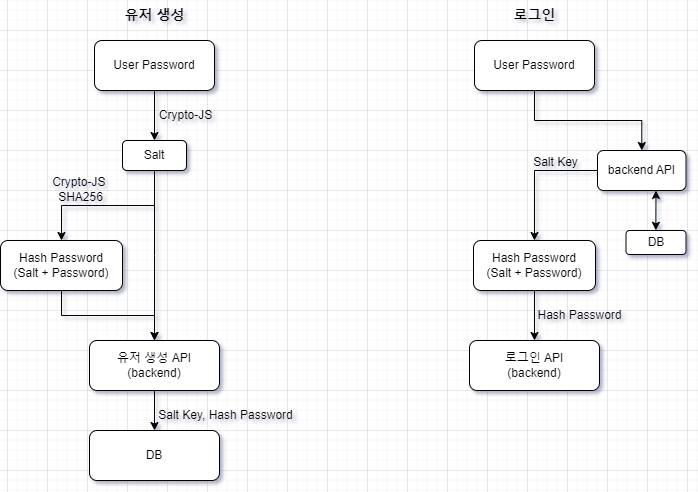
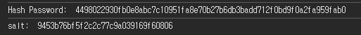

사용자가 로그인하거나 가입했을 때 사용자가 지정한 비밀번호가 그대로 DB에 저장이 되고 있었다.
이는 개발자 모드 네트워크 탭에서도 비밀번호를 확인할 수 있어 비밀번호 노출의 위험이 있다.

**Crypto JS를 이용해 salt를 생성**하고 password + salt 조합으로 **SHA-256 해시 알고리즘(단방향)을 통해 비밀번호를 암호화**하여 DB에 저장하려고 한다.

아래는 내가 사용했던 방식을 기록해 놓았다.


<br/>

## 해시(Hash) 란?

해시는 임의의 길이를 갖는 데이터를 고정된 길이의 데이터로 매핑하는 `단방향 함수`를 말한다.
- 암호화된 데이터는 복호화가 불가능하다.
- 입력값이 동일하면 암호화 데이터 또한 동일하다.
- 입력값과 상관없이 항상 일정한 길이의 암호화 데이터를 출력한다.
- 입력값이 다르지만 암호화 데이터가 같을 수도 있다.

### SHA 256

가장 많이 사용되는 해시 알고리즘은 다이제스트 크기가 256비트인 `SHA 256` 이다. 

> 암호화된 데이터는 다이제스트(digest)라고 한다.

<br/>

## Crypto JS

JS 에서 해시 함수를 통한 암호화를 할 수 있도록 해주는 Node.js 패키지

[Crypto JS npm](https://www.npmjs.com/package/crypto-js)

<br/>

### 플로우

시작하기 전에 로그인과 회원가입 플로우를 다이어그램으로 그려봤다.



**유저 생성(회원 가입)**
1. 랜덤 **salt** 생성 
2. password + salt 조합으로 SHA256 해시 (다이어그램에는 반대로 적어놨다. `실수`) = **Hash Password**
3. 유저 생성 api 호출 시 **salt**와 **Hash Password** 전송

**로그인**
1. DB에 저장되어 있는 해당 유저 salt 가져오기
2. password + 가져온 salt 조합으로 SHA256 해시
3. 로그인 api 호출 시 **Hash Password** 전송

<br/>


<br/>

설치 하시고
```bash
# npm 설치
npm install crypto-js
```

랜덤 salt 생성하는 함수와 사용자가 입력한 password + 생성된 salt 조합을 생성하는 함수를 만든다.
```ts
// crypto-format.ts

import CryptoJS from 'crypto-js';

// 랜덤 salt 생성
export const generateSalt = (length: number) => {
  return CryptoJS.lib.WordArray.random(length).toString();
};

// password + salt 생성
export const hashPassword = (password: string, salt: string) => {
  const hash = CryptoJS.SHA256(password + salt).toString(CryptoJS.enc.Hex);
  return { salt, hash };
};
```

사용할 때는 랜덤으로 생성할 salt 길이를 설정하고 생성된 salt 로 hashPassword 함수를 호출한다.
```ts
// page.tsx
const createHashPassword = () => {
  const newSaltKey = generateSalt(16);
  const { salt, hash } = hashPassword(userData?.password, newSaltKey);

  return { salt, hash };
};
```

이렇게 생성된 salt 와 Hash Password


회원가입 or 로그인 api 호출 시 필요한 값을 사용하면 된다.
```ts
const { salt, hash } = createHashPassword();

// ... api 호출 로직일듯
body: {
    id: id,
    password: hash,
    salt: salt
}
// ...
```

```toc
```