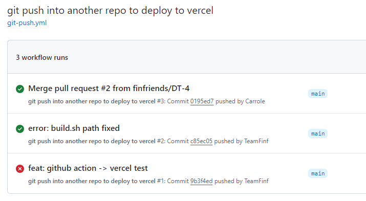

Github Organization 레포를 Vercel에 배포를 하려면 `유료 플랜`이 필요하다.

Organization 레포를 fork 해서 **무료로 배포하는 방법**을 기록하려고 한다.

<br/>

## Todo

Organization 레포 main branch에 `merge`를 하면 **Vercel에 배포**되게 작업

<br/>

### 플로우


1. 다른 branch에서 작업 후 main branch로 merge한다. 
2. main branch에 merge 완료.
3. github action을 통해 fork한 개인 유저 레포로 코드 전체를 보낸다.
4. 개인 유저 레포 main branch가 변경되면 vercel에서 자동 배포를 진행한다.

<br/>

## 해보자


<br/>

### 개인 계정에서 할 일

1. Organization 레포를 **개인 레포로 fork** 한다.`public`
2. Vercel에 로그인 후 fork한 레포(개인 레포)를 연동한다.
3. 개인 유저의 secret 토큰을 발급한다.
   
    > `ghp_`로 시작하는 토큰은 다시 볼 수 없으니 어딘가에 잘 기록해야함.

<br/>

### Organization 레포에서 할 일

1. Organization 레포 setting에서 **개인 계정에서 만든 토큰**과 **개인 계정 이메일**을 `secret 변수`로 등록한다.
   > setting -> Secrets and variables -> Actions
   
2. Organization 레포 Root에 `build.sh` 파일을 생성하여 아래 내용을 입력한다.
   ```bash
   #!/bin/sh
   cd ../
   mkdir output
   cp -R ./team-repo-name/* ./output
   cp -R ./output ./team-repo-name/ 
   ```
   > [team-repo-name] 은 Organization 레포에 있는 프로젝트 이름을 입력한다.
3. github actions 탭에서 .github/workflows/git-push.yml 파일을 생성한다.
   > set up a workflow yourself 버튼을 눌러 생성 가능하다.
   ```bash
   name: Deploy
   
   on:
     push:
       branches: [main]
   
   jobs:
     build:
       runs-on: ubuntu-latest
       container: pandoc/latex
       steps:
         - uses: actions/checkout@v2
         - name: Install mustache (to update the date)
           run: apk add ruby && gem install mustache
         - name: creates output
           run: sh ./src/web/build.sh
         - name: Pushes to another repository
           id: push_directory
           uses: cpina/github-action-push-to-another-repository@main
           env:
             API_TOKEN_GITHUB: ${{ secrets.AUTO_ACTIONS }}
           with:
             source-directory: 'output'
             destination-github-username: [your-repo-github-username]
             destination-repository-name: [your-repo-name]
             user-email: ${{ secrets.EMAIL }}
             commit-message: ${{ github.event.commits[0].message }}
             target-branch: main
         - name: Test get variable exported by push-to-another-repository
           run: echo $DESTINATION_CLONED_DIRECTORY
   ```
   > your-repo-github-username과 your-repo-name에 fork한 개인 레포 소유자의 username과 repo 이름을 적어준다.

<br/>

## 결과는 성공적



위 사진처럼 성공과 실패가 나타나게 된다.

<br/>

### 해야할 일

아직 더 해야할 일이 남았다.

유저가 main branch로 merge한 후에 fork 레포를 타는 것까지는 문제가 없는데 vercel에서 빌드할 때 오류가 나는 경우가 있다.

이를 방지하기 위해 유저가 main branch로 merge하기 전,<br/>
Pull Request를 올리게 되면 **build 테스트를 진행**한 후에 `성공하면 PR 후 merge`를 할 수 있게 action을 추가해야할 것 같다.

이건 다음 포스트에서 


```toc
```