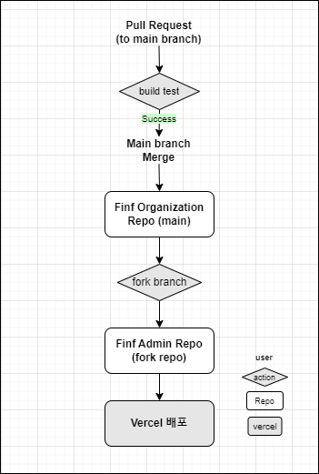
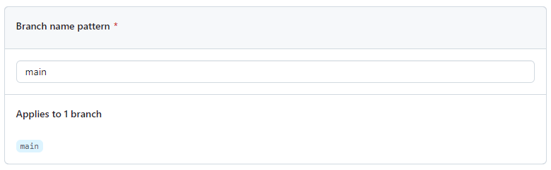
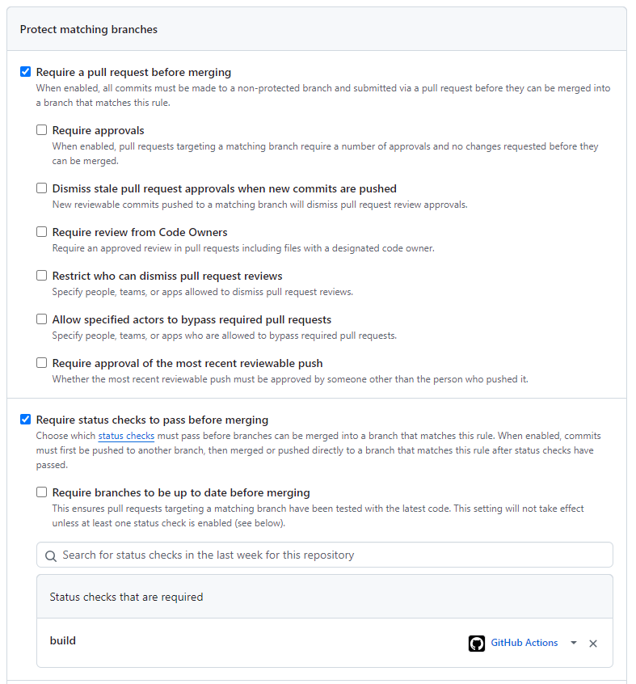

저번 포스트에서 [Organization 레포를 Vercel에 자동 배포하는 방법](https://www.devwoodie.com/17-organization-vercel)을 다뤘다. 

<br/>

### 발생 오류

main branch에 merge가 되면 자동으로 배포가 진행되는 플로우인데 정작 `vercel에서 build 시 발생하는 오류`를 잡지 못하고 있었다.

그러기 위해선 **main branch 에 PR을 올렸을 때 build 를 실행해 오류를 먼저 잡아내는 플로우**가 추가로 필요했다.

<br/>

### 플로우



Organization 레포를 Vercel에 자동 배포하는 플로우에서 PR 올렸을 때 **build test를 진행하는 플로우**가 추가되었다. 

<br/>

## 해보자


<br/>

### yml 파일 추가

main branch에 PR 올렸을 때 실행할 플로우가 담긴 yml 파일을 추가한다. `build-test.yml`

```bash
# github actions 이름
name: PR Build Test

# pull request 감지할 branch
on:
  pull_request:
    branches: [main]
```

실행할 내용은 
- **코드 내려받기**
  - actions/checkout@v2
- **프로젝트 내에 사용 중인 yarn 버전 사용하기**
  - corepack enable
- **Install dependencies**
  - yarn install
- **lint test**
  - yarn lint
- **build test**
  - yarn build

<br/>

### build-test.yml

```bash
name: PR Build Test

on:
  pull_request:
    branches: [main]

jobs:
  build:
    runs-on: ubuntu-latest
    steps:
      - name: 📥 Checkout code
        uses: actions/checkout@v2

      - name: ⚙️ Enable Corepack
        run: corepack enable

      - name: 📦 Install dependencies
        run: yarn install

      - name: 🧹 Lint test
        run: yarn lint || exit 1

      - name: ✅ Build Test
        working-directory: ./src/web
        run: yarn build || exit 1
```

이모지는 알아보기 쉽게 그냥 넣어준 것이고 exit 1 은 해당 내용이 실패하면 에러를 뱉는 코드이다.

<br/>


<br/>

### Github Setting

레포지토리 세팅을 해줘야한다.

Setting -> Branches -> Branch protection rules 추가

**Branch name pattern**에는 관리할 branch 명을 입력한다.



**Protect matching branches**

활성화
- **Require a pull request before merging**
  - merge 할 때 PR 을 사용해야 한다는 내용
- **Require status checks to pass before merging**
  - merge 하기 전 status 체크가 통과해야 한다는 내용

그리고 **status check 에 build 를 검색해서 적용**해준다.

다른 내용은 읽어보고 필요에 따라 활성화하면 된다.



적용을 해주면 main branch에 PR이 올라갈 때 마다 build test를 실행하고 통과가 되면 merge가 가능한 화면이 나온다.

Github Actions 탭에서 확인이 가능하고 에러가 발생하면 어떤 이유인지 볼 수 있다.

<br/>


```toc
```