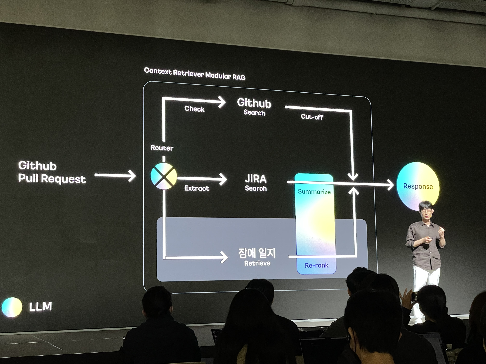

이번 포스트는 **카카오 컨퍼런스 강의 내용을 정리**해서 담아보았다.

물론 다른 컨퍼런스 강의처럼 **본인들이 개발한 내용이나 해결한 문제점들을 발표하는 자리**이긴 하지만 <br/>
내 목표인 카카오에서 진행하는 것이라 그런지 더 애정이 갔던 것 같다. <br/>
이번엔 내용 정리가 좀 힘들어서 들으면서 적은 그대로 담은 것 같다.

강의 내용 말고 다녀온 후기는 <a href="https://www.devwoodie.com/20-2024-ifkakao" target="_blank">여기에</a> 작성해 보았다.

<br/>


일단 강의 내용 먼저
### 정리해보자

<br/>


## [ Kakao AI Native ]

> 정규돈 CTO - 카카오 

- 카카오의 AI Native 전략 
  - 내부 크루들의 일상에도 자연스럽게 녹아드는 것이 목표



### 카카오 AI Native 성숙도 레벨

1. **탐색 ~ 적용 단계**
   - 2년 정도 소요
   - AI 활용단계 모색
   - **좋은 서비스를 만들려면 먼저 경험해봐야** 한다.
   - **교육 및 세미나**(최신 ai 기술 학습), **테크톡**(지식 공유), **ai 해커톤**(아이디러 서비스화) 진행
2. **적용 ~ 혁신 단계**
   - 일하는 방식의 변화
     - AI Buddy (아지트, 지라, 위키를 통합하기 위해 만듬)
       - ai 업무 지원
       - 지식 통합
       - 지능형 오피스 라이프 지원
     - Code Buddy
       - 효율적인 코드 리뷰를 위해 개발됨
       - PR 요약, 맞춤 리뷰, 자동 코드 제안
   - AI 플랫폼 구축
     - KAP (Kakao Ai Platform)
   - AI를 포인트로 서비스에 적용
     - 한번에 적용하면 위험할 수 있기 때문에 포인트적으로 적용
     - 카카오 페이(보험 진단 ai)
     - 카카오 헬스케어(혈당 관리 vision ai) - pasta
     - 카카오 엔터(웹툰 쇼츠 제작 ai 도입)
     - 카카오 모빌리티(자율 주행 기술과 서비스 로봇)
3. 혁신 
   - 2025년은 카카오에 **AI 도입이 가속화하는 시간**
4. 일상
   - 지금의 카카오톡, 카카오뱅크, 카카오 모빌리티.. 이런 플랫폼이 우리 일상에 녹아 있는 것처럼 여기에 AI를 자연스럽게 적용 시키겠다.
   


<br/>

## [ Essence of Kanana Model Family ]

> 김병학 Kanana Header - 카카오

왜 카카오가 LLM을 개발할까?

우리 서비스의 문제를 해결하는 실용적인 LLM

- 카카오가 지향하는 LMM
  - 사용자와 깊이 있는 상호작용을 낼 수 있어야 함
  - 대화의 흐름을 읽고 액션을 할 수 있어야 한다.

그것이 바로 서비스에 최적화된 Kanana Model

사람처럼 보고 듣고 말하는 Kanana

- 언어모델
    - 고성능 초거대 언어모델
    - 중소형 언어 모델
    - 초경량 언어모델
- 멀티모달, 언어 모델
- 비주얼 생성 모델
- 음성 모델

아래 사진으로 대체


<br/>

## [ NVIDIA AI Native Company ]

> Ty McKercher - NVIDIA


좋은 말인 것 같았다.


pass~

<br />

## [ TDD 로 앞서가는 프론트엔드: 디자인, API 없이도 개발을 시작하는 방법 ]

> 김선호 - 카카오

1. **개발의 병목 요소, 프론트엔드**
    1. ‘아직 FE 개발이 진행중이에요~ ’ 이라는 개발 지연 사유가 있다.
    2. 프론트엔드 개발 플로우 중 하나
        1. 다른 직군들이 끝난 다음에 진행하는 경우가 많음.
           
    3. 디자인, 마크업, API 없이 무엇을 할 수 있을까?
        1. 기획서 → 일정 산정 -> 기술 검증 → 프로젝트 문서 작성 → 기술 스택 논의 → 개발 환경 논의 → 배포 방식 논의 → 깃 레포 생성 → 개발 인프라 세팅
2. **워터풀 방식의 프론트엔드 개발방법 뒤집기**
    1. ‘API, 마크업이 아직 나오지 않았습니다~’ 라는 흔한 FE의 개발 지연 사유
    2. 문제 해결 키워드
        1. 컴포넌트(분리 가능한 화면의 구성 요소)
            1. 화면의 구성요소
            2. 동시에 기능 요소이기도 한다.
            3. 기능 구현에 필수적인 요소는 아니다.
            4. 기능 요구 사항은 기획서에 정의되어 있다.
        2. 테스트(단위 테스트)
3. **TDD로 프론트엔드 개발하기**
   - **디자인과 마크업이 없는 경우**
        1. 컴포넌트는 상태를 입력받고 뷰를 반환하는 `일종의 함수`이다.
        2. 단위 테스트 내에서 우리는 구체적인 마크업이 성공적으로 그려지고 있는지 알 필요가 없다.
        3. 그저 필요한 요소를 선택해여, 의도한 값이 노출되고 있는지 확인한다.
        4. 마크업 없이 개발한 기능들은 마크업 구조가 아닌 해당 테스트 선택자에 의존성이 있다.
   - **API가 나오지 않은 경우**
        1. 서버가 API를 줄때까지 기다린다?
        2. 인터페이스를 서버로부터 제공받아 Mock API를 만든다
        3. 둘 다 안된다면?
           1. api와 뷰모델의 인터페이스 분리
                1. API Layer
                    1. API의 요청과 응답을 관리한다.
                2. View Model
                    1. 뷰에 직접적으로 사용되는 값을 FE 의도대로 정의한다.
                3. View
                    1. 상위 뷰 혹은 뷰모델에서만 직접 받을 수 있다.
        4. 실제 API를 바인딩하는 과정
            1. 뷰에서 사용하려는 구조와 상이할 수 있다.
            2. 필요없는 값이 담겨 있을 수 있다.
            3. 이러한 상황에 대비해야 한다.
4. **프로젝트에 적용하기: 카카오맵 매장관리 pc**
    1. 모바일 버전으로만 제공되던 매장 관리를 pc 에서 사용할 수 있게 하는 서비스
    2. `문제 1.` 디자인 리소스의 투입 시기가 알 수 없었다(디자인이 5개월가량 지연)
    3. `문제 2.` fe 리소스가 개발 예정 시기에 맞춰 이미 확보되어있었다.
    4. 프로세스 적용 과정
        1. **준비과정**
            1. 기능 단위 일정 산정
                1. 기획서를 **기능 단위**로 어떻게 쪼갤 것인가?
                2. 많은 분량의 기획에 대한 일정을 구성원 별로어떻게 조율할 것인가?
                3. 결과: **기획서 → 기능 분리 → 기능 요구사항 작성 → 일정 산정**(플레닝포커)
                4. 이렇게 작성된 기능 요구사항을 테스트 시나리오로 활용할 수 있다!
            2. 단위 테스트에 익숙하지 않은 팀원들
                1. 무엇을 테스트할 것인가?
        2. **설득과정**
            1. 프로셋 도입에 대한 리스크
                1. 선행 개발로 인한 추가 비용
                
        3. **실행과정**
            1. 복잡한 테스트 케이스들에 대한 진입 장벽
                1. `패턴1.` props를 주입받아 그대로 렌더링해주는 단순한 컴포넌트
                2. `패턴2.` 외부에서 암묵적으로 상태를 주입받아 렌더링해주는 컴포넌트
                3. `패턴3.` 여러 컴포넌트로 구성된 통합 컴포넌트
            2. 기능과 화면을 조합하는 과정에서의 이슈
    5. **개발 타임라인**
        1. 디자인 리소스 인한 투입 시기 지연
        2. 운영 이슈로 인한 api 개발 인력 부족
        3. `TDD`를 통한 선행 개발 시작
    6. **결과**
        1. 총 개발 기간 `약 25% 단축`
        2. 도입하면 좋을듯한 경우
            1. 마크업, 디자인 이슈로 **개발을 미뤄야하는** 팀
            2. FE 리소스가 다른 부서에 비해 **여유가 있는 상황**인 팀

<br />

## [ 선물하기 프론트엔드 성능 개선기 ]

> 문지호 - 카카오

1. **성능 개선의 필요성**
    1. **이탈율**을 줄임
    2. **검색 엔진**에서 높은 평을 받을 수 있다
    3. **매출**과도 관련이 있다
2. **서비스 및 환경 소개**
    1. 사용자가 친구나 가족에게 다양한 선물을 할 수 있는 서비스
    2. 환경
        1. 앵귤러, csr, 웹팩 번들러 사용
        2. 페이지 구조의 개수가 약 100개에 달하는 대규모 애플리케이션
    3. 이전에 적용된 성능 최적화 기법들
        1. 트리 쉐이킹, 페이지 단위 지연 로딩, 번들러 최적화 옵션 적용, 리소스 cdn 이용, 일정 주기 캐싱, 가벼운 라이브러리 사용, 이미지 최적화, 가상 스크롤
3. **성능 개선에 적용된 기법 소개**
    1. `1순위.` 이미지 최적화
        1. 결과 → 카테고리 팝업 기준 **22mb 절감**
        2. 왜 크게 절감될 수 있었을까?
            1. **커머스 서비스 특성**상 이미지가 많은 이슈
        3. 이미지 최적화 기술 소개
            1. 적절한 이미지 사이즈로 변환
            2. **png, jpg, gif 포맷을 webp 포맷으로 변환**
            3. 노출되지 않은 영역에는 지연 로딩
        4. preconnect 를 이미지 포맷에 적용 중
        5. **fetchPriority 적용** 중
            1. 최초 뷰포트에 노출되는 이미지: 우선 순위 high
            2. 뷰포트 외부의 이미지: 우선 순위 low
    2. `2순위.` 폰트 포맷 최적화 적용
        1. woff 2.0 포맷을 적용해 **1.8mb 절감**
    3. `3순위.` index.html 에서 하나의 특정 api 호출 미리하기
    4. `4순위.` 디펜던시 중복 탐지 스크립트 도입
        1. 도입의 필요성을 느낀 이유
            1. 내부적으로 의존하는 디펜던시들이 많고 중복이 생길 수 있다.
        2. 스크립트 자동화 설정
    5. `5순위.` 사내 라이브러리 코드 스플리팅 고도화
        1. 필요한 이유
            1. 여러 서비스와 공통 라이브러리를 쓰고 있음
            2. 많은 서비스가 사용하고 있기 때문에 커지고 있음
    6. `6순위.` es6 전환 및 core-js 폴리필 최적화
        1. 결과 → **80kb 절감**
        2. es6 지원을 채택한 이유
            1. 유저 유지 가능, 서비스 안정성, 성능 개선
    7. `7순위.` 페이지 내 큰 컴포넌트 단위의 지연 로딩
        1. 결과 → 홈 기준 **80kb 절감**
        2. 홈 화면에 큰 단위의 컴포넌트가 18개가 존재했다.
        3. 유저가 페이지 최초 진입 시 필요하지 않은 페이지를 지연 로딩
        4. 스크롤 케이스 지연 로딩
           
        5. 클릭 케이스 지연 로딩
           
        6. 특정 조건 케이스 지연 로딩
           
        7. 반응성 지연 최소화 방안
           
        8. Tip!
           
4. **성능 개선 결과**
   
5. **성능 개선 후 느낀 점**
    1. 이미지, 폰트 최적화가 큰 부분을 차지함.
    2. js 최적화도 중요함(이미지, 폰트 보다는 크진 않지만)
    3. **총 1.8sec 절감함**
        1. 3.8 → 2.0 sec

<br />

## [ 서비스 UX는 내가 직접 지킨다, 웹 이미지 뷰어 ‘포커스’ 개발기 ]

> 송가람, 한상미 - 카카오

기획자 없이 개발자들끼리 주도적으로 고민했던 이야기가 주제

1. **소개: 포커스 프로젝트: 웹 이미지 뷰어**

- 웹 페이지 내의 이미지를 자세히 볼 수 있도록 돕는 도구
- phocus 프로젝트(photo + focus)
- 2022년 10월 → 2024년 5월 정식 배포
- svelte, ts, anime.js 사용

2. **개요: 그 배경 이야기**

   티스토리, 브런치스토리, 다음 카페, 카카오 맵 모두 이미지 뷰어가 필요했지만 각각 다른 이미지 뷰어를 사용하고 있었음.
    - **사용자 관점에서 본 문제 분석**
        - 한정적이고 불균형한 기능
        - 일관되지 않은 ui/ux
        - 디바이스별 대응 부족
    - **개발자 관점에서 본 문제 분석**
        - 외부 코드 의존성
            - 라이브러리 내에서 발생하는 이슈를 대응하기 어려움
        - 비효율적인 리소스 운영
            - 중복 개발
            - 유지보수 비용 증가

3. **개발: 서비스를 빛내는 요소들**
    1. 사용자 친화적인 이미지 뷰어를 제공하려면?
        1. 이미지 뷰어로서 **필요한 기능을 전부 갖춘**.
            1. 기능 구체화
                1. 이미지 뷰어 리서치/서비스별 기능 취합
                2. 피처리스트 작성
                3. 기획서 제작
    2. 조금 더 사용하기 좋게 만들 수는 없을까?
        1. **그리드**
            1. 이미지 목록 가시성 향상
        2. **상하 스와이프 제스처 지원**
            1. 한 손 사용성
    3. 사용자에게 시스템의 상태나  다음에 발생할 일을 예측할 수 있게 돕는 **피드백 제공**
        1. 투명도 변화 / 애니메이션 효과
            1. 이미지 뷰어 열고 닫기
        2. gravity 효과
            1. 액션의 반대 방향으로 끌어당기는 효과
    4. 많은 슬라이드를 렌더링하면 발생하는 기능 저하
        1. 가상 슬라이드 사용
            1. 필요한 슬라이드만 돔에 추가하는 슬라이드 방법
        2. 이미지 스케일링
            1. 핀치를 이용한 구현 방식
                1. 핀치 이벤트 발생시 두 점 사이의 거리와 중심 좌표를 계산
                2. 스케일링 타겟 지점을 핀치의 중심에 맞게 조정
                3. 이미지 배율이 커질수록 확대가 잘 되지 않는 불편함이 있었음
                    1. 현재 배율에 따라서 가중치를 적용하여 문제 해결
            2. 더블탭을 이용한 구현 방식
                1. 핀치 이벤트와 동일한 방식을 이용하여 구현
                    1. 두점 사이의 거리는 임의의 상수값 이용
                    2. 스케일링 위치는 더블탭의 중심 좌표 사용
                    3. 더블탭의 중심을 기준으로 이미지를 축소하면 이미지가 화면을 벗어나는 문제 발생
                        1. 이미지의 다음 산태를 미리 계산 가능
            3. 제스처 충돌 - 사용자 입력이 발생할 때 의도치 않은 인식이 되는 것
                1. 디바운스, 상태 관리 사용해서 이슈 해결
                2. 터치 임계점 사용해서 이슈 해결
                    1. 이벤트가 유효한지 판단
    5. 개발자 경험
        1. api
            1. 옵션
                1. 라이브러리 동작 방식을 설정할 수 있는 값
            2. 메서드
                1. 개발자가 라이브러리의 기능을 실행할 수 있도록 제공
            3. 이벤트
                1. 라이브러리에서 발생하는 산태의 변화를 감지
                2. 이벤트 핸들러를 등록하여 라이브러리와 서비스의 상호작용을 가능하게 함
        2. css
            1. css 변수를 커스텀해 사용

4. **회고: 걸어온 길과 앞으로 길**
   - 무엇을 개선하면 좋을까?
     - 사용자 입장에선?
       1. 인터랙션 디자인
       2. 모멘텀 스크롤의 부재
       3. 트랙패드 줌의 부재
     - 개발자 입장에선?
       1. 확장성
       2. 플러그인

<br />

## [ 웹 성능 게이트 키퍼: 웹 성능 모니터링 서비스, ‘파루스’ 의 기술과 활용 ]

> 정현규, 남민우 - 카카오

1. **파루스란?**
    1. **Synthetic Monitoring** 을 제공하는 서비스
        1. `lighthouse` 기반 성능 측정
        2. 성능 측정 `자동화`
    2. 웹 서비스 개발 과정에서 성능적인 측면의 인사이트 제공
2. **기능과 구조**
    1. `기능1.` **측정**
        1. **측정 서비스/페이지** 설정
            1. url 기반 측정 대상 설정
            2. 실험실 환경 설정
            3. 커스텀 설정 제공
        2. **측정 시점**
            1. 주기 측정
                1. 자동으로 매 6시간마다 반복
                2. 전체 페이지에 대해 측정 수행
            2. 즉시 측정
                1. 사용자가 직접 트리거
                2. 원하는 타이밍에 주기 측정 가능
        3. **측정 방법**
            1. 측정 요청 → lighthouse(사이트 진입 → 기록 분석 → 리포트 생성) → 리포트
            2. 배포 방식
                1. 쿠버네티스 배포
                2. 사내 인프라 연동
    2. `기능2.` **리포트**
        1. **단일 측정 분석**
            1. 특정 시점의 분석 정보 제공
                1. lighthouse 보고서
                2. trace 정보
            2. 시점 별 비교 분석
                1. 항목 별 점수 증감표
        2. **점수 변화 그래프**
            1. 점수 변화를 시각화한 정보 제공
                1. 시간 흐름에 따른 점수 추이 확인
                2. 기간 선택 가능
            2. row 데이터 제공
                1. 쿼리 가능
    3. `기타`
        1. **알림 기능**
            1. 임계 점수 아래로 내려가면 알림
        2. **pharus devtools**
            1. 개발자 도구를 통한 손쉬운 파루스 측정
            2. 파루스 측정 환경 접근성 증대
3. **주요 기술과 특징**
    1. 파루스 고민!
        1. **측정이 너무 오래 걸린다**
        2. **측정 시간대 별 점수 편차가 심하다**
        3. **측정이 자주 실패하거나 오류가 발생한다**
    2. **안정성**
        1. 측정 `안정성`에 영향을 주는 요인
            1. 측정 환경 변경으로 인한 측정 결과가 달라짐
            2. 안정성 유지하기 위한 방법
                1. 안정적인 환경 구성
                2. 효율적인 에러 처리
                3. 확장성 있는 인프라 구조
                4. 측정 상태 모니터링
        2. 브라우저 선택과 버전 관리
    3. **신뢰성**
        1. 측정 점수를 `신뢰`할 수 있어야 한다.
        2. 명확한 특정 방식과 평가 기준의 조건
            1. 측정 방법
            2. 측정 횟수
                1. `5회 측정`할 때 , 분산이 대략 `50% 정도 낮아짐`
                2. 측정 시간과 정확도를 고려해서 5회 측정으로 결정
            3. 점수 평가
    4. **사용성**
        1. 편리하고 `차별화된 기능`을 제공해야함
        2. 개발 시점에 파루스 사용이 어려움
            1. 파루스는 기본적으로 url 기반으로 동작
            2. 그래서 개발한 것이 pharus devtools
                1. 개발 시점에 측장할 수 있어야 한다.
4. **활용 사례와 성과**
    1. 사내 활용
        1. 성능 측정 점수를 기준으로 제시
        2. 팀 목표 과제로 활용


<br />

## [ 웹 카카오톡의 상태 관리: 바닐라 상태 관리 모듈과 리액트의 조화 ]

> 이기웅 - 카카오

웹 카카오톡 담당 - 웹톡 - 아직 출시 전

1. **웹 카카오톡에 대하여**
    - 사용 가능한 모든 위치에서 제공 가능
    - 여러 타입의 채팅방 지원
    - 기타 앱 클라이언트의 기능 제공 목표

**개발 당시 기획과 디자인이 없는 상태**였다.
prototype → state → product

2. **웹톡의 상태관리 구조**
    1. 웹톡의 요청 처리 순서
        1. 서버 요청의 수신 및 전파
        2. 이벤트 분류, 검증 및 전처리 등의 로직 수행
        3. 최종 상태 생성 및 반영
        4. 외부 메서드 정의 및 데이터 구독 제어
        5.  —> 객체의 관리 방법 도입 필요
    2. 의존성 주입
        1. inversify js
        2. 객체 내 생성 책임 제거
        3. 의존성의 구현체에 의존하지 않음
        4. 객체 등록 후 컨테이너에 의존성 관리 위임
        5. 데코레이터 기반의 의존성 체크 및 조립

3. **리액트 밖의 로직을 연결하기**
    - 바닐라 상태 관리 모듈
        - tearing
            - react18 의 동시성 렌더링
                - 유저 입력등의 고우선순위 요청을 렌더링 중 처리
            - 렌더링 중 상채 변화로 컴포넌트간 동기화 이슈
        - useSyncExternalStore
            - subscribe
                - 스토어의 변화를 알림
            - getSnapshot
                - 스토어 상태를 제공
    - 기존 상태관리 도구의 상태 가져오기
    - 부분 상태 조회 흉내내기
    - useSyncExternalStoreWithSelector

4. **적용 시나리오**

   예제 시나리오
    1. useSyncExternalStore 로 비즈니스 모듈에 연결
    2. 서버에서 새로운 메시지 수신
    3. 메시지에 대한 전처리 수행

5. **결론**

- 뷰 영역과 분리된 비즈니스 로직 우선 개발을 위함 바닐라 모듈 구현
- 리액트 영역에 외부 스토어를 적용하기 위한 훅 적용
- 구조 설계에 개한 러닝 커브
    - 불변성 객체 관리
    - 객체간 의존성 관리 정책
- 뷰, 로직 분리를 통한 유연한 구조 변경 대응 가능

```toc
```
