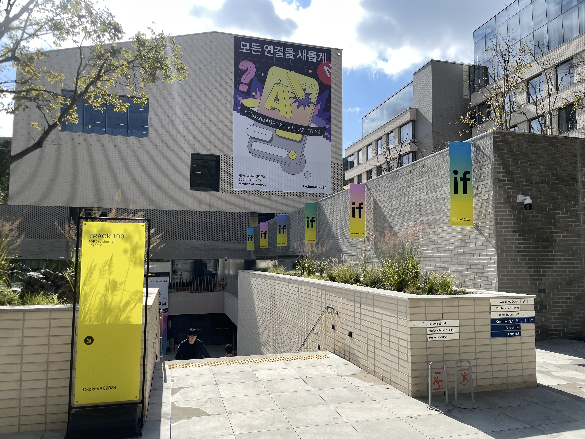
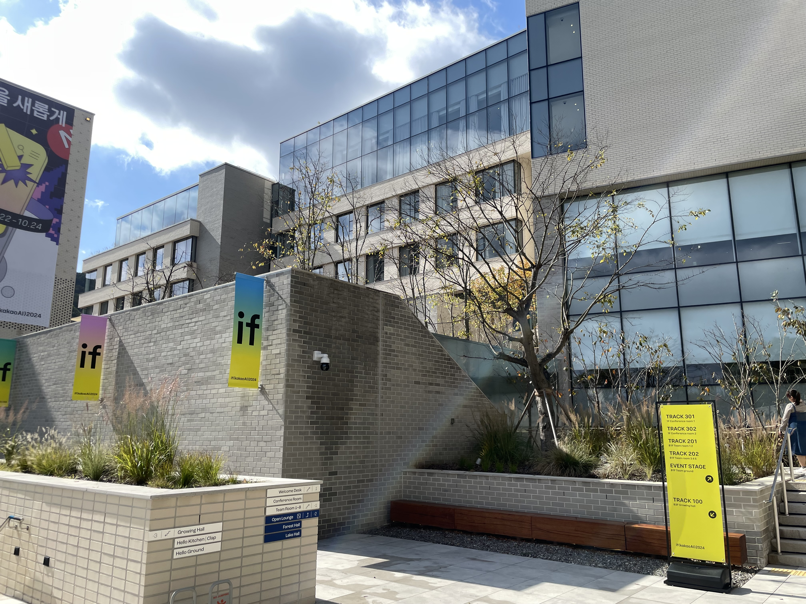
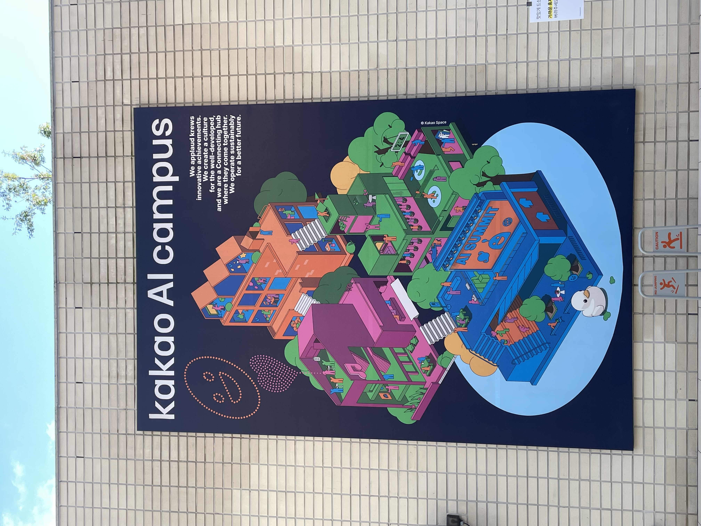
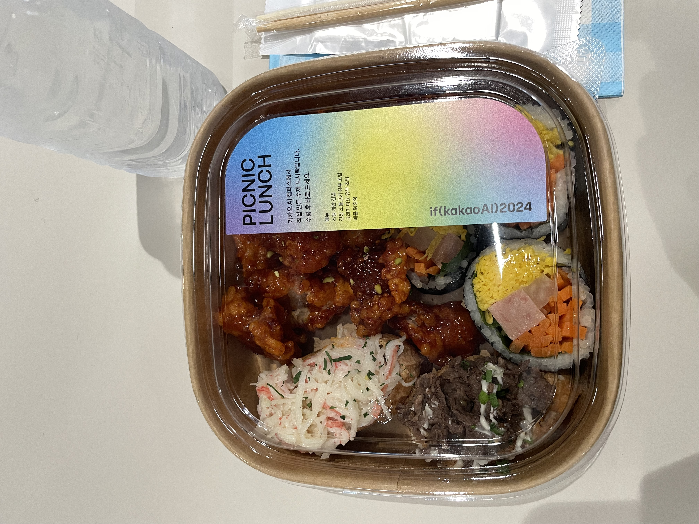

이번엔 카카오 컨퍼런스를 다녀왔다.<br/>
주제는 지금까지의 카카오 서비스들에 **AI가 접목된다**는 이야기였던 것 같다.

경쟁률이 쎌 것 같았는데 의외로 참가자로 선정이 되었다.<br/>
회사에도 신청한 FE개발자분이 계셨는데 그 분은 안됐다는..<br/>
나라도 즐기고 와야지 어쩌겠어ㅎ


이 글은 그저 다녀온 후기에 관한 포스트이고 강의 내용은 [여기에](https://www.devwoodie.com/19-2024-ifkakao-cont) 남겨놨다.

## if(KakaoAI)

이번 카카오 컨퍼런스는 `3일간` 진행되었다.<br/>
강의 주제는 거의 AI 내용이었고, FE 개발자인 나로써는 FE 강의가 몰려있는 `2일차`에 신청했다.<br/>
컨퍼런스 전, 관련된 내용은 카카오톡의 챗봇에게 물어보면 친절히 답변을 해주었다.<br/>
`와이파이, 점심, 충전, 셔틀 등등..`<br/>
역시 카카오 👍
<br/>
앞서 얘기했듯이 이번 카카오 컨퍼런스 주제는 이름부터 **if(kakaoAI)** 인 만큼<br/>
**만약 카카오와 AI가 합쳐진다면?** 이라는 내용이었다.<br/>
<br/>
판교역에서 셔틀버스를 타고 카카오AI센터로 향했다.
<br/>


> 셔틀에서 받았던 카카오 굿즈

<br/>
제일 놀란 것은 카카오AI센터 건물이 너무 좋았다.



<br/>


역시 카카오 👍

## 그 안에서

들어가면서 커피와 아몬드를 받고 오전 **키노트 세션**을 들었다.<br/>
카카오 정규돈 CTO를 시작으로 NVIDIA의 수석 부사장이 와서 키노트 세션을 채웠다.<br/>

### 점심 도시락

점심은 도시락을 줬는데, 컨셉은 피크닉? 이었던 것 같다.
<br/>


> 맛은 그저 그랬..

### 계열사 부스


## 느낀점


```toc
```
