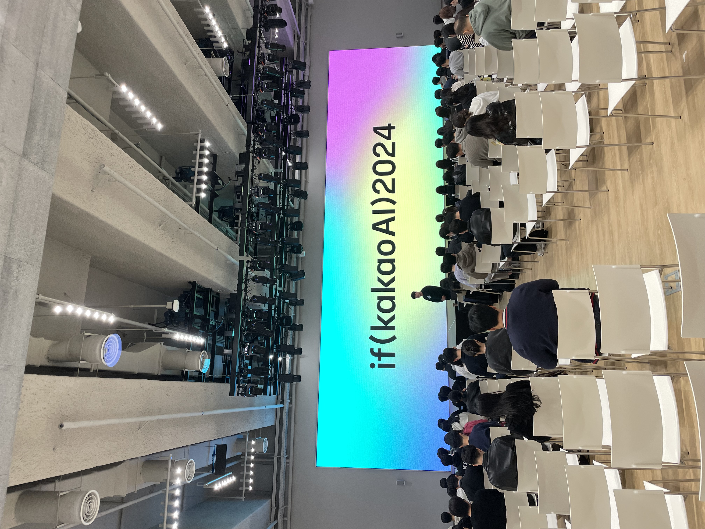

이번엔 카카오 컨퍼런스를 다녀왔다.<br/>
주제는 지금까지의 카카오 서비스들에 **AI가 접목된다**는 이야기였던 것 같다.

경쟁률이 쎌 것 같았는데 의외로 참가자로 선정이 되었다.<br/>
회사에도 신청한 FE개발자분이 계셨는데 그 분은 안됐다는..<br/>
나라도 즐기고 와야지 어쩌겠어ㅎ


이 글은 그저 다녀온 후기에 관한 포스트이고 강의 내용은 <a href="https://www.devwoodie.com/19-2024-ifkakao-cont" target="_blank">여기에</a> 남겨놨다.

## if(KakaoAI)

이번 카카오 컨퍼런스는 `3일간` 진행되었다.<br/>
강의 주제는 거의 AI 내용이었고, FE 개발자인 나로써는 FE 강의가 몰려있는 `2일차`에 신청했다.<br/>
컨퍼런스 전, 관련된 내용은 카카오톡의 챗봇에게 물어보면 친절히 답변을 해주었다.<br/>
`와이파이, 점심, 충전, 셔틀 등등..`<br/>
역시 카카오 👍
<br/>
앞서 얘기했듯이 이번 카카오 컨퍼런스 주제는 이름부터 **if(kakaoAI)** 인 만큼<br/>
**만약 카카오와 AI가 합쳐진다면?** 이라는 내용이었다.<br/>
<br/>
판교역에서 셔틀버스를 타고 카카오AI센터로 향했다.
<br/>


> 셔틀에서 받았던 카카오 굿즈

<br/>
제일 놀란 것은 카카오AI센터 건물이 너무 좋았다.


<br/>


역시 카카오 👍

## 그 안에서

들어가면서 커피와 아몬드를 받고 오전 **키노트 세션**을 들었다.<br/>
카카오 정규돈 CTO를 시작으로 NVIDIA의 수석 부사장이 와서 키노트 세션을 채웠다.<br/>



### 점심 도시락

점심은 도시락을 줬는데, 컨셉은 피크닉? 이었던 것 같다.
<br/>


> 맛은 그저 그랬..

### 계열사 부스


> 카카오의 다른 계열사들이 참석해서 부스를 채웠다.


> 카카오 모빌리티의 자율주행 택시


> 카카오 모빌리티의 자율 주행 로봇 배송 서비스 설명
 

> 그냥 귀여움

<br />

그리고 이번 컨퍼런스의 메인 주제였던 **카카오 AI인 Kanana**


Kanana는 우리 채팅방 속에서 불편함을 도와줄 수 있다고 한다.<br />
예를 들어, 단톡방에 나중에 참여하게 되면 기존에 나눴던 중요한 내용을 모르기 때문에 Kanana에게<br/>
"내가 들어오기 전에 중요한 내용 정리해줘" 라고 물어보면 정리해서 알려준다고 한다.<br/>
물론 다른 사람에게는 안보이고 나만 볼 수 있다.<br/>
등등 다른 여러 편리한 기능이 있다고..

<br/>

오후에는 여러 강의실들에서 강의가 진행되었는데 나는 하나의 강의실에서만 계속 들었다. 


> 내가 들었던 DAY2에 강의들

강의 내용 정리는 <a href="https://www.devwoodie.com/19-2024-ifkakao-cont" target="_blank">여기</a>


## 정리

기대를 많이해서 그런지 아쉬움도 컸다.<br />
먼저 강의실이 협소해서 서서 듣는 사람도 많았고, 보통 노트북을 가져와서 기록을 하는데 테이블이 없어서 다들 무릎에 노트북을 두고 기록했다. (의자가 너무 딱딱해..)<br />
그리고 지난번 <a href="https://www.devwoodie.com/15-2024-feconf" target="_blank">2024 FECONF 를 다녀와서 적어놓은 글</a>에도 얘기했듯이 나는 **컨퍼런스의 꽃은 굿즈**라고 생각한다.<br/>
사실 여러 컨퍼런스에서 진행되는 강의들은 본인들의 회사에서 진행했던 업무를 어떻게 잘 해결했는지 발표하는 내용이라 비슷하다고 생각한다. (물론 배울 것은 많다.)<br/>
근데 굿즈가 너무 없어서 아쉬웠다는..
<br/>
그래도 중간중간 `간식 부스`가 여러군데 있었고, 다른 컨퍼런스보다 인원이 적어 `쾌적한 환경`에서 다닐 수 있었다. 계열사 부스를 이동하는데도 불편함 없이 다닐 수 있었고, 점심을 먹는 줄이나 화장실에도 사람들이 몰리지 않았다.
건물이 좋아서 그릉가
<br/>
<br/>
올해 토스, 당근, 우형 컨퍼런스에 다 떨어지고 그래도 **내 최애인 카카오**에 참가자로 뽑혀서 기분은 좋았다.<br/>
큰 컨퍼런스들은 끝났지만 카카오 컨퍼런스에 다녀온 것으로 위안삼고 내년에는 더 많은 컨퍼런스에 붙었으면 좋겠다.


```toc
```
