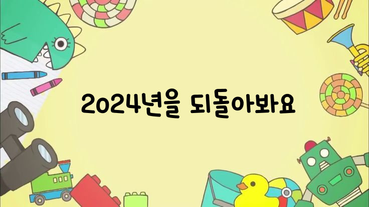
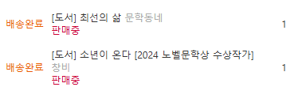

<br/>

2024년은 겉으로 봤을 때 심플한 해였지만 내면적으로는 근심 걱정이 많았던 한 해였던 것 같다.

연초부터 일을 쉬게 되었고 상반기 6개월은 `휴식기`, 하반기 6개월은 `활동기`라고 정리할 수 있을 것 같다.

<br/>

## 🏠 상반기 (1월 ~ 6월)

갑작스럽게 연초부터 백수가 되었고 나는 금방 직장을 구할 것이라고 생각했다.

실업급여도 나왔기 때문에, 이렇게 된 이상 한두달 정도 쉬다가 다시 직장을 구해야겠다고 마음먹고 편하게 쉬었던 것 같다.

> 그것은 안일한 생각...

두달정도 쉬고 나서 이력서를 수정하고 여러 공고들에 지원을 했다. 누구나 그렇듯 초반에는 따질 것 다 따져가면서 완벽하게 마음에 드는 회사만 지원을 했다. 

서류 합격 후 코테도 몇 번 보고 1차 면접도 보다보니 시간이 많이 흘렀다. 물론 연락이 안 온 곳도 있지만..

슬슬 발등에 불이 떨어졌다. 지원해도 연락이 안오는 회사들이 많아졌고, 이력서를 보완하기 위해 내가 무엇을 할 수 있을지 생각했다.

당시 경력을 더 쌓을 수 없는 상황이었던지라 사이드 프로젝트를 진행해보기로 했다. 전 직장에서 같이 권고사직 처리가 된 백엔드 개발자 한 분이랑 사이드 프로젝트를 시작했다.

일기록 이라는 프로젝트로 매일 일기를 쓰고 포인트를 얻어서 자신의 홈피를 꾸밀 수 있는 서비스였다. <br/>
[일기록 GitHub](https://github.com/ilgilog/ilgilog-fe?tab=readme-ov-file#%EC%9D%BC%EA%B8%B0%EB%A1%9D---%EC%9D%BC%EA%B8%B0%EC%93%B0%EA%B3%A0-%EB%AF%B8%EB%8B%88%ED%99%88-%EA%BE%B8%EB%AF%B8%EA%B8%B0)

프로젝트를 진행 중에도 공고는 매일 확인하면서 지원을 했다. 쉬는동안 루틴이 된 것 같았다. 

실업급여는 7월 초까지 나오는 것으로 예정되어 있었기 때문에 6월에는 합격을 해야한다는 압박감이 있었다. 

종종 서류 합격 후 면접 연락이 오긴했지만 이상하게 6월에 많이 왔던 것 같다. 

다행히 회사에 합격해 7월부터 근무하기로 결정이 되었고 편안함과 불안함이 공존했던 상반기를 보냈다.

지나고 생각해보니 더 놀걸 그랬다.. 라는 생각보다 현재 내 상황에 경각심을 주고 긴장감을 일깨워준 시기라고 생각한다.

> 누구나 그럴싸한 계획을 갖고 있다. 쳐맞기 전까지는..

<br/>

## 🏢 하반기 (7월 ~ 12월)

하반기는 회사에 입사 후 공부를 하면서 개발을 계속 했고, 개발 컨퍼런스에 참석도 했다. 

2024년에 다녀온 컨퍼런스는 FECONF와 IFKAKAO 두 곳.<br/>
[2024 FECONF 후기](https://www.devwoodie.com/15-2024-feconf) <br/>
[2024 If KAKAO 후기](https://www.devwoodie.com/20-2024-ifkakao) <br/>

다른 컨퍼런스도 지원했지만 탈락했고, 운이 좋게 두 곳을 다녀왔다.

개발 컨퍼런스를 다녀오면 배우는 것들이 많다. 어떤 회사에서 어떠한 이슈들이 발생하고 어떤 방식으로 해결하는지 배울 수 있다. 
더불어 스폰 회사들의 굿즈를 받을 수 있다는 점?

개발자들끼리 커뮤니티 형성을 위해 가는 곳이기도 하지만 나는 항상 혼자 다녀왔기 때문에 조금 힘든 부분이 있었다.
> 이미 커뮤니티를 형성해서 같이 오시는 분들이 많기에..

올해 컨퍼런스에 갈 수 있는 기회가 생긴다면 노력해봐야겠다.. 고 매년 다짐하긴한다.

그리고 개발 동아리나 사이드 프로젝트를 시작했지만 끝맺음을 하지 못했다.

같이 기획을 할 때는 의지가 활활 불타오르다가 현생 이슈로 시간을 만들기 힘들고 이런 저런 핑계를 만들다보니 그렇게 된 것 같다.

`그렇다할 동기부여가 없었기 때문인가` 라는 혼자만의 핑계를 만들어 봤지만 결론적으로는 내 의지 부족인 것 같다. 

<br />

## 👤 개인적으로는

개인적으로 2024년 상반기에 해외 여행을 다녀왔다. 연차를 내지 않고는 가기 힘든 해외 여행을 상반기 휴식기에 다녀왔고, 말로만 듣던 일본 지진을 겪었다.

여진이 우리나라 부산까지 왔다고 했는데, 내가 있던 후쿠오카 주변에서 지진이 발생했기 때문에 직접적으로 지진을 겪은 것이었다. 살아 돌아왔으니 특별한 경험이 되었다ㅎ

이외에도 국내로 여행을 많이 다녔고, 취미인 테니스도 자주 치려고 했다. 

작년 회고를 적다보니 이직이라는 큰 이슈 말고는 잔잔하게 보냈던 것 같다. 

지나간 일은 후회를 안하려고 생각하기 때문에 후회되는 일 보다는 조금 아쉬웠던 점으로 기록하고 싶다.

2024년에 아쉬웠던 점은 책을 읽지 못했던 점이 제일 큰 것 같다.

e북 리더기로 출퇴근할 때 책을 읽었었는데 지금 출퇴근을 할 때는 유튜브만 보면서 출퇴근을 하고, 집에 와서도 읽지않았다.

올해는 책을 좀 읽어보자 라는 생각으로 2025년이 되자마자 책 두 권을 샀다. 



두 권 모두 길지 않은 책이니까 이 책들을 시작으로 올해는 독서를 꾸준히 해보려고 한다. 

2023년 회고록 보다는 심플한 회고록이 된 것 같다. 어떻게보면 큰 이슈 없이 물 흐르듯 한 해를 보내는 것이 쉽지 않은 일인 것 같다.

올해는 자의가 됐던 타의가 됐던 쉬지 않고 계속 일을하며 한 해를 보내는 것이 목표이고 작은 목표로는 자기개발을 하는 것.


```toc
```
