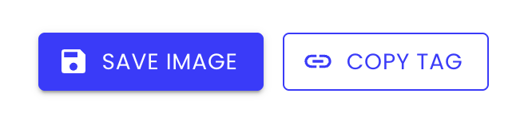

## Git Tiers

1년 동안 깃허브 commit, pull request 등 **GitHub 활동 contribute에 따라 티어를 볼 수 있는 프로젝트**를 만들어 보았다. 

Git Tiers 에서는 본인의 티어에 대한 정보를 얻을 수 있으며 ``이미지로 저장이 가능``해 본인의 깃허브 README.md 에 보여줄 수 있다.

[**Git Tiers 홈페이지**](https://git-tiers.devwoodie.com)

Git Tiers 깃허브 페이지에는 티어 순서와 contribute 수에 따른 티어 표가 있다.


차후 계획은 유저가 이미지를 직접 다운로드해서 깃허브 README.md 에 넣는 방식이 아닌, <br />
본인만의 URL을 생성해서 깃허브 README.md 에 URL만 저장해 놓으면 티어가 변경될 시  <br />
이미지를 변경해야하는 불편함 없이 자동으로 변경이되는 기능을 구현해볼 계획이다.

<br />

사용하는 유저가 많아져 누군가의 깃허브를 들어갔을 때, README.md 에 Git Tiers가 보였으면 좋겠다.
https://github.com/git-tiers/gittiers

<br />

**++ 추가 업데이트 ++**
<br />
기존의 유저가 이미지를 직접 다운로드해서 깃허브 README.md 에 이미지를 첨부하는 방식에서 <br />
본인만의 URL을 생성해서 깃허브 README.md 에 URL만 저장해 놓으면 티어가 변경될 수 있도록 업데이트 되었다.

firebase firestore를 이용해서 유저가 가입/로그인 할 때 정보를 저장해놓고, 해당 정보로 github api를 이용해 티어를 생성한다.<br />
티어 이미지 설정 값들과 티어 이미지를 base64로 인코딩해서 firebase firestore에 저장해놓는다.<br />

```
{
    access_token: 'gho_xxx',
    first_login: '2025-08-31T14:17:50.505Z',
    imageSettings: {
        contributeCount: 1802,
        isCard: "card",
        isMode: "dark",
        isText: "exist"
    },
    lastUpdated: "2025-08-31T14:17:50.505Z",
    last_login: "2025-08-31T14:17:50.505Z",
    loginId: 'devwoodie',
    tierImageBase64: 'data:image/jpeg;base64'
}
```
<br />

유저가 로그인 했을 때 정보를 가져와서 설정 화면에서 저장된 값들을 보여주고, <br />
Next.js app router로 ``https://git-tiers.devwoodie.com/api/tier/${loginId}`` <br />
url에 접속하면 base64로 인코딩된 이미지를 디코딩해서 보여준다.



설정 내용들을 저장한 후에 copy tag 버틑을 누르면 아래 내용이 클립보드에 복사가 된다.

```js
<a href="https://github.com/git-tiers/gittiers">
  
</a>
```

해당 내용을 본인 깃허브 README.md에 넣으면 완성.

추가로 생각한 업데이트할 내용은 <br />
배경 색을 사용자가 color picker로 선택할 수 있게 하는 기능을 추가할 계획이다.<br />
다른 기능들은 추후에 생각나는대로 추가할 예정이다.

```toc
```
