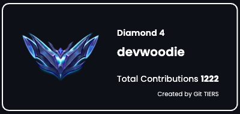

## Git Tiers

1년 동안 깃허브 commit, pull request 등 **GitHub 활동 contribute에 따라 티어를 볼 수 있는 프로젝트**를 만들어 보았다. 

Git Tiers 에서는 본인의 티어에 대한 정보를 얻을 수 있으며 ``이미지로 저장이 가능``해 본인의 깃허브 README.md 에 보여줄 수 있다.

[**Git Tiers 홈페이지**](https://git-tiers.devwoodie.com)

Git Tiers 깃허브 페이지에는 티어 순서와 contribute 수에 따른 티어 표가 있다.



차후 계획은 유저가 이미지를 직접 다운로드해서 깃허브 README.md 에 넣는 방식이 아닌, <br />
본인만의 URL을 생성해서 깃허브 README.md 에 URL만 저장해 놓으면 티어가 변경될 시  <br />
이미지를 변경해야하는 불편함 없이 자동으로 변경이되는 기능을 구현해볼 계획이다.

<br />

사용하는 유저가 많아져 누군가의 깃허브를 들어갔을 때, README.md 에 Git Tiers가 보였으면 좋겠다.
https://github.com/git-tiers/gittiers

```toc
```
