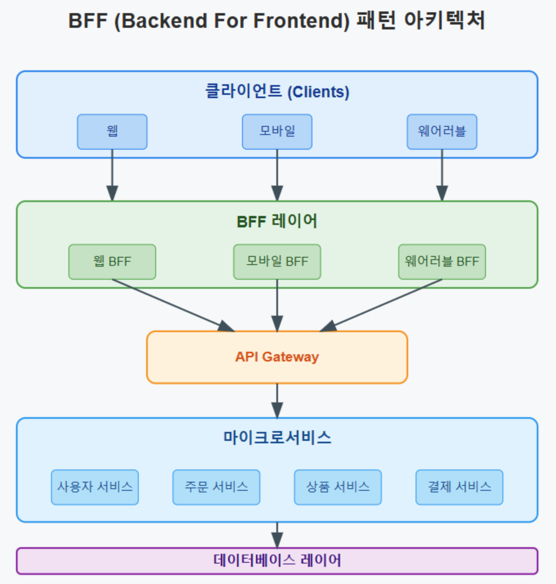

## BFF(Backend for Frontend)란?
프론트엔드(웹, 모바일, 디바이스 등)별로 특화된 백엔드 API를 따로 두어, <br />
클라이언트가 필요한 데이터와 로직만을 최적화해서 제공하는 아키텍처 패턴.



### 등장 배경
- 단일 API 서버(모놀리식, 혹은 단일 백엔드)가 여러 클라이언트(웹, iOS, Android, IoT)에 동일한 응답을 주다 보니, 불필요한 데이터가 포함되거나 필요한 데이터가 빠지는 문제가 발생. 
- 각 클라이언트의 UX 최적화를 위해 등장한 개념.

## 왜 필요한가?
- **클라이언트 맞춤 최적화**
  - 웹은 넓은 화면에 많은 데이터가 필요하지만, 모바일은 데이터 사용량이 적고 UI도 간단해야 함 
  - BFF는 각 클라이언트 특성에 맞는 API 응답을 제공
- **복잡한 API 호출 단순화**
  - 여러 마이크로서비스에서 데이터를 모아야 하는 경우, 클라이언트에서 직접 여러 API를 호출하면 복잡해짐 
  - ``BFF가 중간에서 조합해 클라이언트는 단일 API만 호출``
- **보안 및 정책 제어**
  - 인증, 권한 검증, 로깅 등 클라이언트에 따라 달라질 수 있는 정책을 BFF에서 통제 가능

## BFF의 장점
- 프론트엔드 개발 속도 향상 (필요한 데이터만 바로 받음)
- 클라이언트별 UI/UX 최적화 
- 마이크로서비스와 프론트엔드 간 결합도 감소 
- 유지보수 용이 (각 프론트엔드 팀이 독립적으로 API 개발 가능)

## BFF의 단점
- BFF가 늘어날수록 관리 포인트 증가 (웹용, 앱용, 관리자용 등)
- 중복 로직 발생 가능성 (각 BFF에서 비슷한 데이터 조작)
- 아키텍처 복잡도 증가

## 언제 쓰면 좋은가?
- 여러 클라이언트를 동시에 운영하는 서비스 (웹 + 앱)
- 프론트엔드 팀이 백엔드와 독립적으로 빠르게 움직여야 할 때 
- UX 최적화를 위해 클라이언트별 응답 구조가 달라야 할 때

## 결론
BFF 패턴은 **"클라이언트 맞춤형 API 게이트웨이"** 같은 역할로, 다양한 클라이언트 환경에서 최적화된 API를 제공하는 강력한 아키텍처 패턴이다.
특히 마이크로서비스 아키텍처에서 API의 유연성을 유지하면서도 ``클라이언트별 맞춤형 데이터 제공이 가능``하다는 점에서 큰 장점을 가진다.
다만, 운영 및 유지보수의 복잡성이 증가할 수 있으므로, 적절한 모니터링 시스템을 도입하여 안정적인 운영을 유지하는 것이 중요하다.

<br/>
<br/>

[출처]
https://velog.io/@sleekydevzero86/bff-pattern-best-practices

```toc
```
